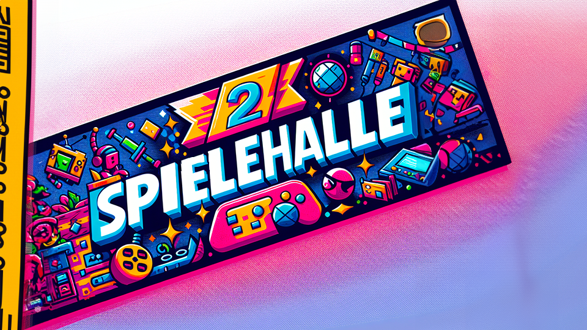
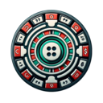

 

  

<h3 align="center"> Spielehalle</h3>

  

    Der offizielle Spielehalle Bot
     
    <a href="https://discord.com/users/216487432667791360"><strong>Contact »</strong></a>
     
     
    <a href="https://discord.gg/PEqVSTwy2K">MainServer</a>
  

 
 

## Developer Documentation

If you feel like there is something missing, feel free to [open a issue](https://github.com/CoasterFreakDE/Spielehalle/issues/new)

> **Note:** This documentation is still in progress and will be updated frequently.